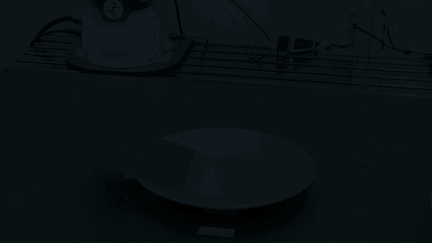

<h1 align="center">OpenWAM: An Open Framework<br>for Composable World-Action Models</h1>

<p align="center">
  Heng&nbsp;Yu<sup>*</sup>, David&nbsp;D.&nbsp;Yuan<sup>*</sup>, Juze&nbsp;Zhang<sup>*</sup>, Changan&nbsp;Chen, Yao&nbsp;Feng,<br>
  Michelle&nbsp;Baldonado, Steve&nbsp;Cousins, Li&nbsp;Fei-Fei, Jiajun&nbsp;Wu, Ehsan&nbsp;Adeli
</p>
<p align="center">Stanford University<br><sup>*</sup> Equal contribution</p>

<p align="center">
  <a href="https://www.stanford.edu/"></a>
  &nbsp;&nbsp;&nbsp;
  <a href="https://ai.stanford.edu/"></a>
  &nbsp;&nbsp;&nbsp;
  <a href="https://svl.stanford.edu/"></a>
  &nbsp;&nbsp;&nbsp;
  <a href="https://stai.stanford.edu/"></a>
  &nbsp;&nbsp;&nbsp;
  <a href="https://src.stanford.edu/"></a>
</p>

<br>

<p align="center">
  <a href="https://arxiv.org/pdf/2610.07922"></a>
  <a href="https://openwam.stanford.edu/"></a>
  <a href="https://openwam.github.io/OpenWAM/"></a>
  <a href="https://github.com/OpenWAM/OpenWAM/actions/workflows/ci.yml"></a>
  <a href="https://www.python.org/"></a>
  <a href="https://github.com/OpenWAM/OpenWAM/blob/main/LICENSE"></a>
</p>

<p align="center">
  <a href="https://arxiv.org/pdf/2610.07922">Paper (PDF)</a> &middot;
  <a href="https://openwam.stanford.edu/">Research blog</a> &middot;
  <a href="https://openwam.github.io/OpenWAM/">Technical documentation</a> &middot;
  <a href="https://huggingface.co/OpenWAM-Stanford/OpenWAM-Pretraining">Models</a> &middot;
  <a href="#citation">Citation</a>
</p>

**OpenWAM** is an extensible and composable framework for world-action models
and the official implementation of [our paper](https://arxiv.org/pdf/2610.07922).
It brings causal robot-video pretraining, video-action policies, and
independently trained dynamics models into a shared training and evaluation
framework.

<p align="center">
  
</p>

## Capabilities

- **Video pretraining:** train causal predictors on single-view and multiview
  robot video.
- **Video-action interaction:** configure video-first, action-first, joint, and
  decoupled generation with shared-transformer or dual-expert architectures.
- **Inverse and forward dynamics:** infer actions from supplied video
  trajectories (IDM), or predict future observations conditioned on actions (FDM).
- **Custom experiments:** add datasets, policies, action decoders, and
  simulators through the extension SDK.

The framework includes LIBERO, RoboTwin, CALVIN, and LeRobot data integrations.
See [architectures and interaction programs](https://github.com/OpenWAM/OpenWAM/blob/main/docs/policy_architectures.md)
for supported configurations, including generalist joint denoising.

## Models and data

[**Video-pretrained weights are available on Hugging Face.**](https://huggingface.co/OpenWAM-Stanford/OpenWAM-Pretraining)
The release includes model weights, a reference configuration, and checksums.
Video frontend and text-encoding assets, datasets, and training state are not included.

Policy checkpoints and OpenWAM datasets are being prepared for release.
See the [artifact guide](https://github.com/OpenWAM/OpenWAM/blob/main/docs/artifacts.md)
for release links and setup as these resources become available.

## Quickstart

Linux · Python 3.11 or 3.12 · Alpha-stage research software

Install [uv](https://docs.astral.sh/uv/), then run a small CPU example:

```bash
git clone https://github.com/OpenWAM/OpenWAM.git
cd OpenWAM
uv sync --frozen --group dev --extra train --extra eval

uv run --extra train openwam-sanity \
  --cfg configs/examples/public_tiny_synthetic_contract.yaml \
  --device cpu --max-batches 1 --rollout-steps 1
```

This checks the installation with synthetic data; no GPU, downloaded weights,
or simulator is required. It does not reproduce the paper's results.

Alternatively, install the package from [PyPI](https://pypi.org/project/openwam/)
in a virtual environment:

```bash
python -m pip install 'openwam[train,eval]'
```

See the [quickstart guide](https://github.com/OpenWAM/OpenWAM/blob/main/docs/quickstart.md)
for a complete train–resume–evaluate example and optional dependencies.
For version changes and migration notes, see [releases](https://github.com/OpenWAM/OpenWAM/blob/main/docs/release.md).

## Train a policy

Prepare the [required data and model assets](https://github.com/OpenWAM/OpenWAM/blob/main/docs/running_experiments.md#data-prerequisites),
then register their paths:

```bash
cp configs/local_paths.sample.yaml configs/local_paths.yaml
```

Fill in the paths required by your configuration. The reference dual-expert
LIBERO configuration uses four GPUs and was characterized on four 48 GB GPUs:

```bash
uv run --extra train torchrun --standalone --nproc-per-node=4 \
  -m open_wam.cli.train \
  --cfg configs/experiments/dual_expert_libero_joint.yaml \
  --save-root runs/dual-expert-joint \
  --expected-world-size 4
```

To use video-then-action generation with this configuration, add
`--set policy_variant.program=video_then_action` and choose a new `--save-root`.

See [training and evaluation](https://github.com/OpenWAM/OpenWAM/blob/main/docs/running_experiments.md)
for checkpoint initialization, resume, dynamics training, and benchmark rollouts.

## Documentation

| Task | Guide |
| --- | --- |
| Prepare data and pretrain video models | [Video pretraining](https://github.com/OpenWAM/OpenWAM/blob/main/docs/pretraining/index.md) |
| Configure architectures and interaction programs | [Model configurations](https://github.com/OpenWAM/OpenWAM/blob/main/docs/policy_architectures.md) |
| Set up datasets and simulators | [Benchmarks and data](https://github.com/OpenWAM/OpenWAM/blob/main/docs/benchmarks.md) |
| Add your own components | [Extension SDK](https://github.com/OpenWAM/OpenWAM/blob/main/docs/extension_sdk.md) |
| Reproduce an experiment | [Reproducibility](https://github.com/OpenWAM/OpenWAM/blob/main/docs/reproducibility.md) |

## Citation

If you use OpenWAM in your research, please cite
[our paper](https://arxiv.org/pdf/2610.07922):

```bibtex
@article{yu2026openwam,
  title   = {{OpenWAM}: An Open Framework for Composable World-Action Models},
  author  = {Yu, Heng and Yuan, David D. and Zhang, Juze and Chen, Changan and
             Feng, Yao and Baldonado, Michelle and Cousins, Steve and
             Fei-Fei, Li and Wu, Jiajun and Adeli, Ehsan},
  journal = {arXiv preprint arXiv:2610.07922},
  year    = {2026},
  url     = {https://arxiv.org/pdf/2610.07922}
}
```

The BibTeX entry is also available in [CITATION.bib](CITATION.bib).

## Contributing and license

See [Contributing](https://github.com/OpenWAM/OpenWAM/blob/main/CONTRIBUTING.md)
for development guidance.

OpenWAM is licensed under [AGPL-3.0-only](https://github.com/OpenWAM/OpenWAM/blob/main/LICENSE).
See [NOTICE](https://github.com/OpenWAM/OpenWAM/blob/main/NOTICE) and
[Third-party notices](https://github.com/OpenWAM/OpenWAM/blob/main/THIRD_PARTY_NOTICES.md)
for attribution requirements and separately governed components and institutional marks.
