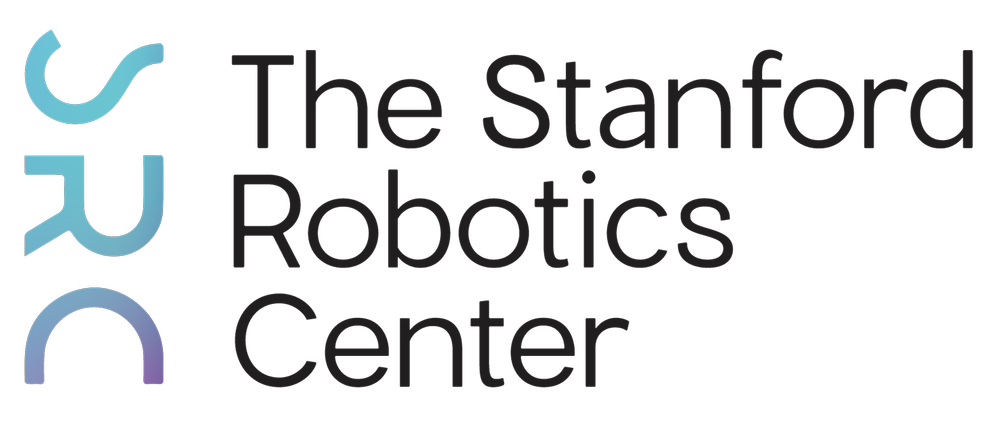

# OpenWAM Documentation

  Developed by the <strong>OpenWAM Team</strong> at the
  <a href="https://svl.stanford.edu/"><strong>Stanford Vision and Learning Lab (SVL)</strong></a>.

  
  
  
  

OpenWAM is an extensible library for training and evaluating world action
models while keeping the shared visual backbone stable. The public docs focus
on reproducible usage, typed extension points, and benchmark contracts.

## Start Here

- [Quickstart](quickstart.md): install, validate configs, and run CPU-safe smoke checks.
- [Architecture](architecture.md): the stable runtime boundary and core abstractions.
- [Compatibility](compatibility.md): supported platforms, SDK surface, and numerical gates.
- [Policy Architectures And Programs](policy_architectures.md): how topology,
  conditioning programs, and decoders compose.
- [Benchmarks and Data](benchmarks.md): LIBERO, RoboTwin, CALVIN, and synthetic fixtures.
- [Training and Inference](running_experiments.md): maintained train, resume,
  eval, sanity, and rollout commands.

## Extension Points

- [Extension SDK](extension_sdk.md): registry surfaces for datasets, policy variants, and decoders.
- [Cookbooks](cookbooks/new_policy_architecture.md): concrete recipes for adding new research components.
- [Artifacts](artifacts.md): checkpoint manifests, local path aliases, and artifact cards.
- [Reproducibility](reproducibility.md): result envelopes, experiment cards, and tracking policy.

## Reference

- [CLI Reference](cli.md): commands and examples.
- [Testing](testing.md): local tests and numerical comparisons for extensions.
- [Releases](release.md): package versions and reproducible installation.
