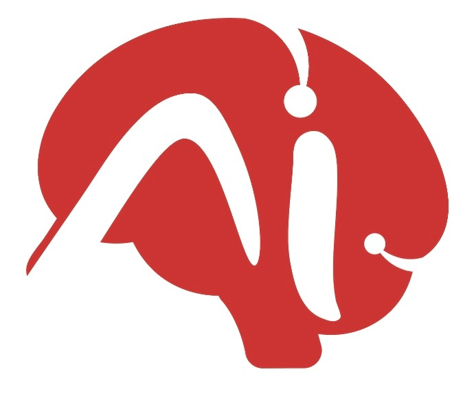
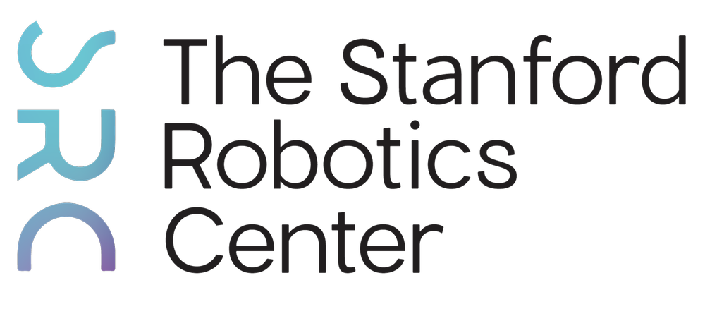

# OpenWAM Documentation

  Heng&nbsp;Yu*, David&nbsp;D.&nbsp;Yuan*, Juze&nbsp;Zhang*, Changan&nbsp;Chen, Yao&nbsp;Feng, 
  Michelle&nbsp;Baldonado, Steve&nbsp;Cousins, Li&nbsp;Fei-Fei, Jiajun&nbsp;Wu, Ehsan&nbsp;Adeli

Stanford University * Equal contribution

  
  
  
  
  

OpenWAM is an extensible and composable library for training and evaluating world action
models while keeping the shared visual backbone stable. Start with a CPU example, then choose a training, evaluation, or extension workflow.

## Start Here

- [Quickstart](quickstart.md): install, validate configs, and run CPU-safe smoke checks.
- [Architecture](architecture.md): the stable runtime boundary and core abstractions.
- [Compatibility](compatibility.md): supported platforms, SDK surface, and numerical gates.
- [Policy Architectures And Programs](policy_architectures.md): how topology,
  conditioning programs, and decoders compose.
- [Benchmarks and Data](benchmarks.md): LIBERO, RoboTwin, CALVIN, and synthetic fixtures.
- [Training and Inference](running_experiments.md): maintained train, resume,
  eval, sanity, and rollout commands.

## Extension Points

- [Extension SDK](extension_sdk.md): registry surfaces for datasets, policy variants, and decoders.
- [Cookbooks](cookbooks/new_policy_architecture.md): concrete recipes for adding new research components.
- [Artifacts](artifacts.md): checkpoint manifests, local path aliases, and artifact cards.
- [Reproducibility](reproducibility.md): result envelopes, experiment cards, and tracking policy.

## Reference

- [Research paper (PDF)](https://arxiv.org/pdf/2610.07922): framework, methods, and experimental results.
- [CLI Reference](cli.md): commands and examples.
- [Rollout Contracts](rollout_contracts.md): sessions, executed history, and control integration.
- [Testing](testing.md): local tests and numerical comparisons for extensions.
- [Releases](release.md): package versions and reproducible installation.
